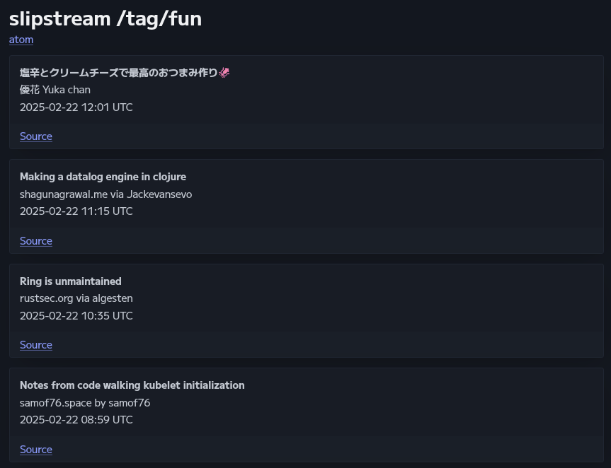

  

<h1 align="center">slipstream</h1>

Feed fetcher, filterer, and aggregator.

## Crates

- `slipfeed` - Feed fetcher, filterer, and aggregator library.
- `slipreader` - CLI feed reader
- `slipstream` - Simple CLI `slipfeed` server utilizing a simple
  [config](examples/config/slipstream.toml).

## Getting Started

### slipstream

`slipstream` is a command-line application for serving filtered/aggregated feeds
from existing feeds a la Yahoo Pipes. A simple configuration file (e.g.
[slipstream.toml](examples/config/slipstream.toml)) is used to define feeds,
relationships, and filters. Running
`slipstream --config <your-config.toml> --port <your-port>` will start a web
server that exposes the following endpoints:

- `/config` for viewing the config (toml).
- `/all` (or `/`) for viewing all entries (html).
- `/feed/<feed_name>` for viewing a specific feed (html).
- `/tag/<tag_name>` for viewing a feed for entries with a specific tag (html).
- `/all/feed` for viewing all entries (atom).
- `/feed/<feed_name>/feed` for viewing a specific feed (atom).
- `/tag/<tag_name>/feed` for viewing a feed for entries with a specific tag
  (atom).

An example can be found at my personal website
[feeds.hachha.dev](https://feeds.hachha.dev/).

## Roadmap

While the `slipfeed` and `slipstream` APIs may not be stable, they are
essentially complete as-is. `slipstream` development was originally intended to
be separate, but it has since been merged into `slipknot` (now named
`slipstream`).

- `slipfeed`
  - [ ] Add other built-in feed implementations (e.g. activitypub)
  - [ ] Allow custom user agents
- `slipstream` (general)
  - [ ] Add more filters (regex/pomsky, allowlists, etc.)
  - [ ] OPML conversion support
  - [ ] Use sqlite for storing entries and feed definitions
  - [ ] Support atom exports
- `slipstream` (reader)
  - [ ] Support pagination (or make automatic)
  - [ ] Indicate pending updates

## Contributing

Simple bug fixes and suggestions are welcome. At this time, more in-depth
contributions will likely be rejected unless communicated and planned
ahead-of-time.
