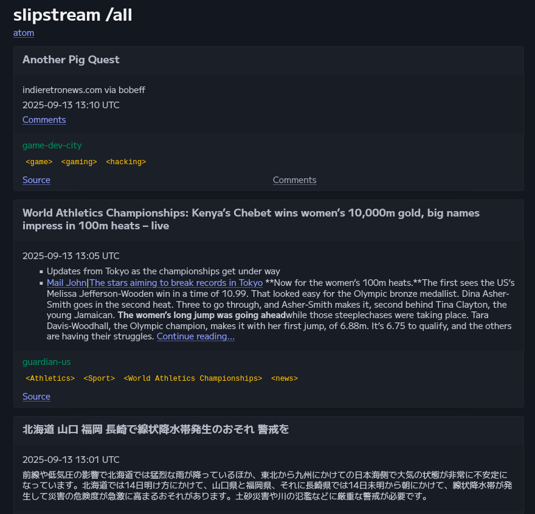
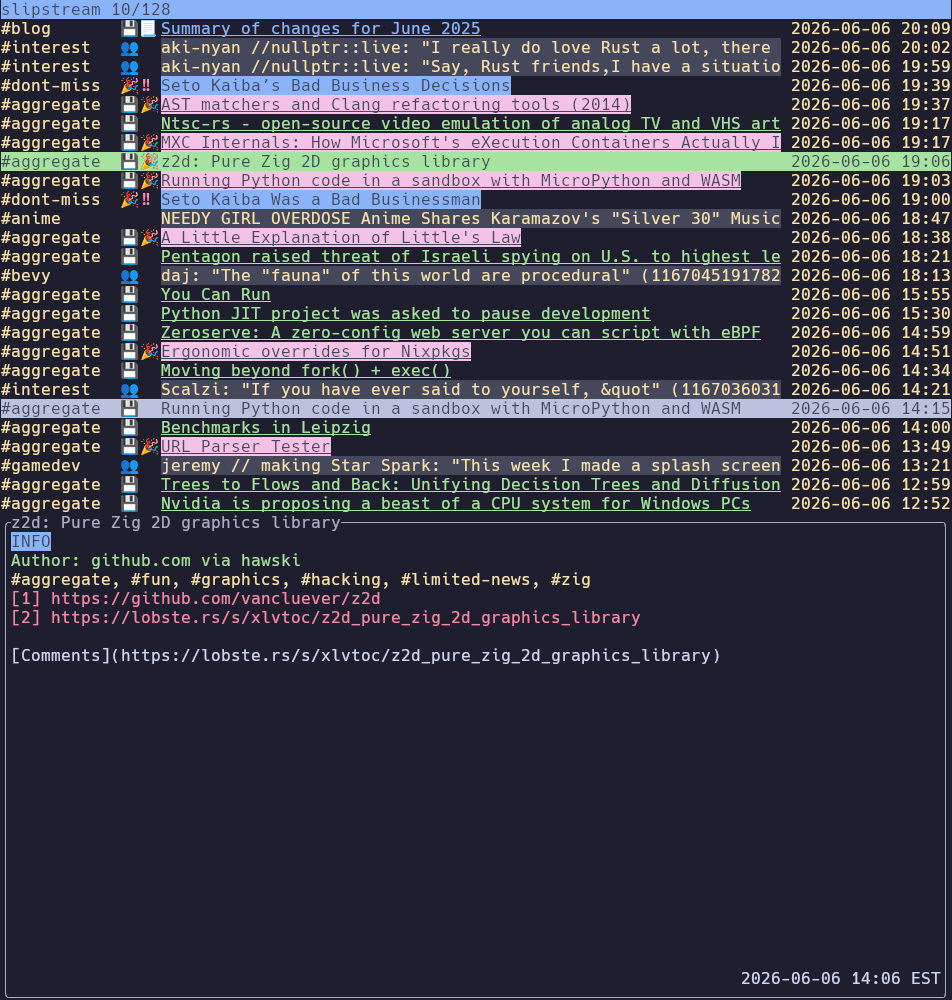

  

<h1 align="center">slipstream</h1>

An all-in-one utility for managing feeds. Slipstream is a feed fetcher,
filterer, and aggregator.

| Utility             | Result                                                                       |
| ------------------- | ---------------------------------------------------------------------------- |
| `slipstream serve`  | Fetch remote feeds from a configuration file and serve over http (HTML/ATOM) |
| `slipstream read`   | Fetch and read feeds in a local tui                                          |
| `slipstream fetch`  | Fetch a remote feed and template the results                                 |
| `slipstream config` | Verify config, import and export feeds                                       |

## Getting Started

### Slipstream

`slipstream` is a command-line application for serving filtered/aggregated feeds
from existing feeds a la Yahoo Pipes. A simple configuration file (e.g.
[slipstream.toml](examples/config/slipstream.toml)) is used to define feeds,
filters, and aggregations.

The original goal of `slipstream serve` was to support a single, self-hostable
service that can aggregate feeds across devices. No need to share `opml` files
across desktops, phones, and laptops-- all feeds can be accessible from a single
new aggregate atom feed. Slipstream supports basic filters for allowlisting and
blocklisting entries from feeds based on substrings and tags. Everything
`slipstream serve` supports, `slipstream read` also supports.

- Fetch entries from various sources (rss, atom, mastodon)
  - Filter entries based on various criteria (allowlist/blocklist tags and
    substrings)
  - Apply & transform tags (aliases)
  - Make new aggregate feeds (composite feeds, matching tags)
- Serve feeds via HTML and Atom (`slipstream serve`)
- View the feeds locally with terminal reader (`slipstream read`)
  - Handle custom keybindings and compound commands
  - Display custom colors & flags based on tag matches
  - Execute shell commands and page the result (archival, fetching)
  - Command execution and result storage

#### Installation

`cargo install slipstream-cli`

#### Serve

Running `slipstream --config <your-config.toml> serve --port <your-port>` will
start a web server that exposes the following endpoints:

| Endpoint                 | Description               | Format |
| ------------------------ | ------------------------- | ------ |
| `/config`                | View the config           | `toml` |
| `/all`                   | View all entries          | `html` |
| `/all/feed`              | View all entries          | `atom` |
| `/feed/<feed_name>`      | View entries in feed      | `html` |
| `/feed/<feed_name>/feed` | View entries in feed      | `atom` |
| `/tag/<tag_name>`        | View entries matching tag | `html` |
| `/tag/<tag_name>/feed`   | View entries matching tag | `atom` |

An example can be found at my personal website
[feeds.hachha.dev](https://feeds.hachha.dev/).

### Read

Running `slipstream --config <your-config.toml> read` will launch a local tui.

Check out the example [config](examples/config/slipreader.toml) to see
additional configuration options.

### Fetch

Running `slipstream fetch <feed-name> <feed-url> --template json` will fetch a
feed and return a JSON object that can be used

## Crates

- `slipstream-cli` - Simple CLI `slipfeed` server and reader utilizing a simple
  [config](examples/config/slipstream.toml).
- `slipstream-feeds` (`slipfeed`) - Feed fetcher, filterer, transformer, and
  aggregator library.

## Configuration Quick-Start (WIP)

- `global`
  - `transforms`
    - `tag-derivastions`
  - `filters`
  - `options`
- `hooks` Event-based actions
  - `on-fetch` - commands run when after _feed_ is fetched
  - `on-insert` - commands run when an _entry_ is inserted
  - `on-update` - commands run when an _entry_ is updated
  - `on-read` - commands run when an _entry_ is read
  - `on-tag` - commands run when an _entry_ is tagged
- `commands` Custom commands for reading or hooks (Referenced by `!`)
  - `name` Command name
  - `command` Array of arguments
    - Arguments substitute several fields (exact matches)
      - `{{link.url}}` - URL of entry source
      - `{{link.url<N>}}` - URL of Nth entry source
      - `{{link.name}}` - Name of link
      - `{{link.name_}}` - Name of link, substituting special characters for
        underscores
      - `{{link.name-}}` - Name of link, substituting special characters for
        dashes
      - `{{feed}}` - Feed of entry
      - `{{terminal.width}}` - Width of current terminal
- `serve`
  - `port` Port to bind to
  - `cache` How long to cache returned items
- `feeds`
  - `<feed>`
    - For standard syndications (RSS/ATOM), set `url` as the HTTP endpoint for
      the feed
    - For tag aggregates, set `tag-allowlist` and `tag-blocklist`
    - For feed aggregates, set `feeds`
    - Feeds additionally support adding-to/overriding the transforms, filters,
      and options from the global settings
    - `step` The phase of fetching to update feed-- this is set automatically
      depending on feed type but may be overridden
- `read`
  - `scroll` Scroll speed (lines)
  - `priority` Tags in order of priority
  - `tags`
    - `colors` Mapping of tag to color or flag, in order of reverse-priority
  - `binding` Map of keybind to command
    - Can reference standard read command literals (e.g., `noop`, `up`,
      `page-down`)
    - Can reference manual read command-mode commands (e.g.,
      `:toggle-tag important`, `:search --tag read-later`)
    - Can reference configured user commands (e.g., `!archive`, `!email`)

## Roadmap

While the `slipstream-feeds` and `slipstream-cli` APIs may not be stable, they
are essentially complete as-is.

### Slipstream 3.0

- `slipstream` (api)
  - [ ] Allow syncing tags & command results from client to server

### Beyond

- `slipstream-feeds`
  - [ ] Custom HTML selector feeds
  - [ ] JSON feeds
- `slipstream-cli` (read)
  - [ ] Better pagination and search
  - [ ] Indicate pending updates

## Contributing

Simple bug fixes and suggestions are welcome. At this time, more in-depth
contributions will likely be rejected unless discussed ahead-of-time.
